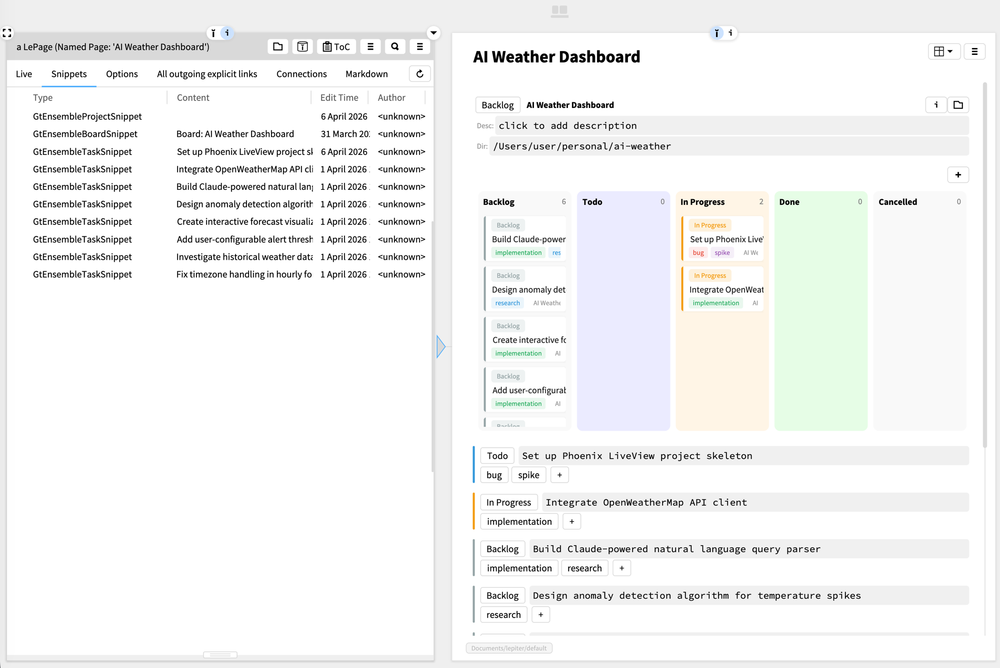

# gt4ensemble

[Glamorous Toolkit](https://gtoolkit.com) project and task management as inspectable Smalltalk objects with Lepiter persistence.

## Features

- **Project board** — kanban view of all projects by status
- **Task board** — kanban view of tasks per project or across all projects
- **Drag-and-drop** status changes on both boards
- **Multi-database** — projects can live in any Lepiter database
- **Tags** — cross-cutting task categorization with color-coded labels
- **Magritte forms** — create projects and tasks via dropdown forms
- **Lepiter snippets** — embed project or task boards inline in any page

**Warning:** This project is experimental and under active development. There may be bugs that could lead to project data loss. Back up your Lepiter databases before use.

## Screenshot



## Installation

```smalltalk
Metacello new
    baseline: 'Gt4Ensemble';
    repository: 'github://dweinstein/gt4ensemble/src';
    load.
```

## Load Lepiter

After installing with Metacello:

```smalltalk
#BaselineOfGt4Ensemble asClass loadLepiter
```

This loads the Ensemble Architecture documentation page.

## Quick Start

```smalltalk
"Inspect the board"
GtEnsembleBoard current.

"Create a project programmatically"
GtEnsembleBoard current
    createProjectNamed: 'My Project'
    directory: '/path/to/project'
    description: 'A new project'.
```
